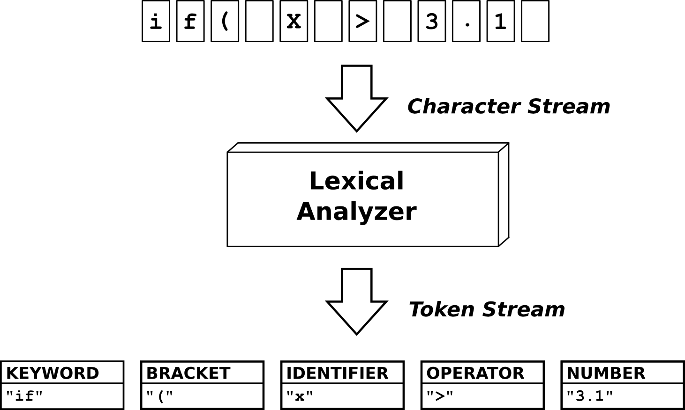

# Analyzer
Lexical analyzer created from regular expressions

# About
Analyzer is a token recognition oriented lexical analyzer using regular expressions to check the rules of assigned grammatical structures.

# Grammar
id + id - id = id + id - id / id   
"id" represents alphanumeric values including decimals.

## Expressions

### Reserved words
* int
* flo
* dou
* boo
* str
* pub
* class
* print
* true
* false

### Operations
* "=="
* ">="
* "<="
* "!="
* "="
* "!"
* ">"
* "<"
* "+"
* "-"
* "/"
* "%"
* "&&"
* "*"
* ";"

### Numbers
Reals and decimals

# Lexical rules
* An identifier cannot be called as a reserved word.
* Expressions must end with a semicolon. (;)
* Expressions cannot be put after the semicolon.
* Identifiers cannot have numbers or special symbols.
* Identifiers must be defined after their data type.
* Identifiers must have at least one separating space with respect to their data type.
* Operation expressions must be defined with only identifiers or numbers.
* Odd operations cannot be performed on an expression.

# Lexical analyzer process

